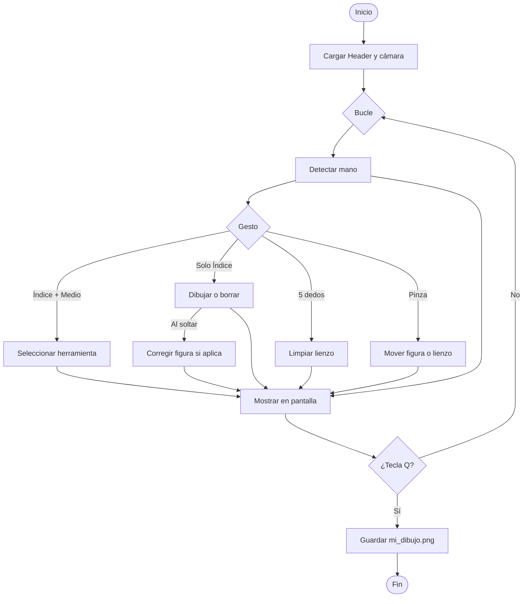

# HANC — Documentación del proyecto

Pizarrón virtual controlado con la mano y la cámara web. El proyecto consta de dos archivos principales de código:

| Archivo | Rol |
|---------|-----|
| `HandTrackingModule.py` | Detecta la mano con MediaPipe |
| `VirtualPainter.py` | Aplicación principal: menú, dibujo, figuras, borrador, guardado |

---

## Diagrama de flujo general



---

## Estructura de carpetas

```
HANC/
├── HandTrackingModule.py
├── VirtualPainter.py
├── crear_header_temporal.py
├── requirements.txt
├── DOCUMENTACION.md
└── Header/
    ├── 1.jpg   (azul seleccionado)
    ├── 2.jpg   (rojo seleccionado)
    ├── 3.jpg   (verde seleccionado)
    └── 4.jpg   (borrador seleccionado)
```

Al cerrar el programa con `q`, se genera automáticamente `mi_dibujo.png`.

---

## 1. `HandTrackingModule.py` — Detección de manos

### Clase `handDetector` — configuración inicial

```python
class handDetector:
  def __init__(self, mode=False, maxHands=2, detectionCon=0.5, trackCon=0.5):
    ...
    self.tipIds = [4, 8, 12, 16, 20]
```

- Inicializa **MediaPipe Hands** para detectar hasta 2 manos.
- `detectionCon` / `trackCon`: confianza mínima de detección y seguimiento (en el pintor se usa `0.65` para ser más exigente y evitar falsos positivos).
- `tipIds`: índices de la punta de cada dedo en el modelo de 21 landmarks (pulgar=4, índice=8, medio=12, anular=16, meñique=20).

### `findHands()` — detectar manos en el frame

```python
def findHands(self, img, draw=True):
  imgRGB = cv2.cvtColor(img, cv2.COLOR_BGR2RGB)
  self.results = self.hands.process(imgRGB)
```

- Convierte la imagen de **BGR → RGB** (OpenCV usa BGR, MediaPipe fue entrenado con RGB).
- Procesa la imagen y guarda los landmarks en `self.results`.
- Opcionalmente dibuja los puntos y conexiones de la mano sobre la imagen.

### `findPosition()` — coordenadas de los 21 puntos

```python
def findPosition(self, img, handNo=0, draw=True):
  ...
  self.lmList.append([id, cx, cy])
```

- Convierte los landmarks normalizados (0–1) a **píxeles** `(cx, cy)`.
- Devuelve `lmList` (lista de `[id, x, y]`) y `bbox` (caja que envuelve la mano).
- El landmark **8** es la punta del dedo índice, usada como cursor del programa.

### `fingersUp()` — qué dedos están levantados

```python
def fingersUp(self):
  if self.lmList[self.tipIds[0]][1] > self.lmList[self.tipIds[0] - 1][1]:
    fingers.append(1)  # pulgar
  ...
  if self.lmList[self.tipIds[id]][2] < self.lmList[self.tipIds[id] - 2][2]:
    fingers.append(1)  # resto de dedos
```

- Devuelve una lista `[pulgar, índice, medio, anular, meñique]` con `1` = arriba y `0` = abajo.
- **Pulgar**: se compara en eje **X** (se abre lateralmente).
- **Otros dedos**: se comparan en eje **Y** (la punta está más arriba que la articulación).

### `detectPinch()` — gesto de pinza

```python
def detectPinch(self, threshold=40):
  distance = math.hypot(indexX - thumbX, indexY - thumbY)
  return distance < threshold, centerX, centerY
```

- Mide la distancia entre el pulgar (landmark 4) y el índice (landmark 8).
- Si la distancia es menor a 40 px, la pinza está activa.
- Devuelve el centro de la pinza, usado para mover figuras o el lienzo completo.

### `findAllHandPositions()` — soporte multi-mano

```python
def findAllHandPositions(self, img, draw=False):
  ...
  handsData.append({
    'lmList': lmList,
    'bbox': bbox,
    'fingers': self.fingersUpFromLmList(lmList),
  })
```

- Extrae landmarks y estado de dedos de **todas** las manos detectadas.
- El pintor actual usa `maxHands=1`, pero el módulo está preparado para dos manos.

---

## 2. `VirtualPainter.py` — Configuración global

```python
brushThickness = 15
eraserThickness = brushThickness * 8
headerHeight = 125
canvasWidth = 1280
canvasHeight = 720

brushColors = [(255, 0, 0), (0, 0, 255), (0, 255, 0), (0, 0, 0)]
menuZones = [(200, 420), (420, 620), (620, 820), (820, 1100)]
cameraFlipCode = 1
```

| Constante | Función |
|-----------|---------|
| `brushThickness` / `eraserThickness` | Grosor del pincel (15 px) y borrador (8× más grande) |
| `headerHeight` | Altura de la barra superior diseñada en Canva (125 px) |
| `canvasWidth` / `canvasHeight` | Tamaño del lienzo (1280×720) |
| `brushColors` | Colores BGR: azul, rojo, verde y negro (borrador) |
| `menuZones` | Rangos en X para cada icono del header |
| `cameraFlipCode = 1` | Espejo horizontal de la cámara |
| `selectionCooldown` | Evita cambiar de color muchas veces por segundo |
| `shapeMinSize` / `minStrokePoints` | Tamaño mínimo para reconocer figuras |

---

## 3. Clase `Shape` — figuras geométricas corregidas

```python
class Shape:
  def __init__(self, shapeType, name, x1, y1, x2, y2, color, thickness=3):
  def setBounds(self, x1, y1, x2, y2):
  def move(self, dx, dy):
  def containsPoint(self, x, y):
  def intersectsLine(self, x1, y1, x2, y2, radius):
```

- Almacena tipo, nombre, color, grosor y caja delimitadora `(x1,y1)-(x2,y2)`.
- `setBounds()`: normaliza coordenadas; si es cuadrado, fuerza lados iguales.
- `move()`: desplaza la figura (usado con la pinza).
- `containsPoint()`: detecta si la pinza está sobre la figura.
- `intersectsLine()`: detecta si el borrador tocó la figura.

Las figuras viven en la lista `shapes[]`, separadas del trazo libre en `imgCanvas`.

---

## 4. Carga del menú (`Header/`)

```python
def loadHeaderImages(folderPath):
  imageFiles = sorted(
    f for f in os.listdir(folderPath)
    if f.lower().endswith(('.jpg', '.jpeg', '.png'))
  )
```

- Verifica que exista la carpeta `Header/` con `1.jpg`, `2.jpg`, `3.jpg` y `4.jpg`.
- `sorted()` garantiza el orden correcto: azul, rojo, verde, borrador.
- Cada imagen representa un estado del menú (qué herramienta aparece seleccionada).

### Selección de herramienta

```python
def selectTool(x, y, overlayList):
  if y >= headerHeight:
    return None, None, None
  for index, (xMin, xMax) in enumerate(menuZones):
    if xMin < x < xMax:
      return overlayList[index], brushColors[index], index
```

- Solo actúa si el dedo está en la barra superior (`y < 125`).
- Según la posición X del índice, devuelve la imagen del header, el color y el índice de herramienta.

---

## 5. Reconocimiento y corrección de figuras

**Flujo:** dibujas con el pincel → al soltar el dedo se analiza el trazo → si coincide con una figura, se reemplaza por la versión geométrica perfecta con su nombre.

### Recolección del trazo

```python
if xp == 0 and yp == 0:
  currentStroke = [(x1, y1)]
else:
  currentStroke.append((x1, y1))
cv2.line(imgCanvas, (xp, yp), (x1, y1), drawColor, strokeThickness)
```

- Cada punto del índice se guarda en `currentStroke`.
- Simultáneamente se dibuja en tiempo real en `imgCanvas` (capa de trazos libres).

### ¿Es un trazo cerrado?

```python
def isClosedStroke(points, x1, y1, x2, y2):
  gap = math.hypot(points[0][0] - points[-1][0], points[0][1] - points[-1][1])
  return gap < max(width, height) * 0.28
```

- Compara el punto inicial con el final del trazo.
- Si la distancia es menor al 28% del tamaño de la figura, se considera cerrada.

### Reconocimiento (`recognizeStroke`)

```python
def recognizeStroke(points, color, thickness):
  approx = cv2.approxPolyDP(contour, 0.04 * cv2.arcLength(contour, True), True)

  if len(approx) == 4:
    if 0.82 < aspect < 1.18:
      return Shape('cuadrado', 'Cuadrado', ...)
    return Shape('rectangulo', 'Rectangulo', ...)

  circleScore = circularityScore(contour)
  if circleScore > 0.72 and 0.65 < aspect < 1.45:
    return Shape('circulo', 'Circulo', ...)

  if looksLikeHeart(points, x1, y1, x2, y2):
    return Shape('corazon', 'Corazon', ...)
```

| Figura | Criterio de detección |
|--------|----------------------|
| **Cuadrado / Rectángulo** | `approxPolyDP` detecta 4 vértices; proporción ancho/alto distingue cuadrado de rectángulo |
| **Círculo** | Circularidad `4π·área/perímetro² > 0.72` y proporción cercana a 1:1 |
| **Corazón** | Proporción ~1:1, dos lóbulos arriba y punta abajo (`looksLikeHeart`) |

### Finalizar y corregir

```python
def finalizeStroke(imgCanvas, shapes, currentStroke, strokeThickness, drawColor):
  recognized = recognizeStroke(currentStroke, drawColor, strokeThickness)
  eraseStrokeFromCanvas(imgCanvas, currentStroke, strokeThickness)
  shapes.append(recognized)
  return shapes, f'{recognized.name.upper()} CORREGIDO'
```

1. Intenta reconocer la figura.
2. Borra el trazo irregular del lienzo (`eraseStrokeFromCanvas` pinta negro encima).
3. Añade la figura geométrica perfecta a `shapes`.
4. Muestra mensaje en pantalla, por ejemplo `CIRCULO CORREGIDO`.

### Dibujo de figuras corregidas

```python
def drawShape(canvas, shape):
  if shape.shapeType == 'circulo':
    cv2.circle(canvas, (centerX, centerY), radius, color, thickness)
  elif shape.shapeType in ('rectangulo', 'cuadrado'):
    cv2.rectangle(canvas, (x1, y1), (x2, y2), color, thickness)
  elif shape.shapeType == 'corazon':
    cv2.polylines(canvas, [heartPoints(...)], True, color, thickness)
  cv2.putText(canvas, shape.name, (x1, labelY), ...)
```

- Dibuja la figura geométrica y escribe su **nombre** encima.

---

## 6. Gestos en el bucle principal (`main()`)

### Inicialización

```python
cap = cv2.VideoCapture(0, cv2.CAP_DSHOW)
cap.set(3, canvasWidth)
cap.set(4, canvasHeight)
detector = htm.handDetector(detectionCon=0.65, maxHands=1)
imgCanvas = np.zeros((canvasHeight, canvasWidth, 3), np.uint8)
```

- Abre la cámara a 1280×720 con backend Windows `CAP_DSHOW`.
- `imgCanvas`: lienzo negro donde se guardan los trazos libres.
- `shapes`: lista de figuras corregidas geométricamente.

### Procesamiento de cada frame

```python
img = cv2.flip(img, cameraFlipCode)
img = detector.findHands(img)
lmList, _ = detector.findPosition(img, draw=False)
```

1. Voltea la cámara en espejo horizontal.
2. Detecta la mano.
3. Obtiene la posición del índice.

### Tabla de gestos

| Gesto | Código | Acción |
|-------|--------|--------|
| Índice + medio arriba | `fingers[1]==1 and fingers[2]==1` | Seleccionar color/borrador en el menú |
| Solo índice arriba | `fingers[1]==1 and fingers[2]==0` | Dibujar o borrar |
| 5 dedos arriba | `all(fingers)` | Limpiar todo el lienzo |
| Pinza (pulgar + índice) | `detectPinch()` | Mover figura o mover lienzo |
| Soltar dedo tras dibujar | `wasDrawing and not isDrawing` | Corregir figura si aplica |

### Gesto: seleccionar herramienta

```python
if fingers[1] == 1 and fingers[2] == 1:
  selectedHeader, selectedColor, selectedIndex = selectTool(x1, y1, overlayList)
  if now - lastToolChange > selectionCooldown:
    header = selectedHeader
    drawColor = selectedColor
```

- Cambia el color activo, la imagen del header y la herramienta seleccionada.
- `selectionCooldown` evita cambios repetidos al pasar el dedo por el menú.

### Gesto: dibujar / borrar

```python
elif fingers[1] == 1 and fingers[2] == 0:
  if drawColor == (0, 0, 0):
    shapes = eraseShapesWithStroke(shapes, xp, yp, x1, y1, eraserThickness)
  else:
    strokeThickness = getDynamicThickness(xp, yp, x1, y1)
  cv2.line(imgCanvas, (xp, yp), (x1, y1), drawColor, strokeThickness)
```

- **Pincel**: trazo con grosor dinámico (movimiento lento = trazo grueso, rápido = fino).
- **Borrador**: dibuja líneas negras gruesas y elimina figuras que intersecta.

### Gesto: limpiar todo

```python
elif all(fingers):
  imgCanvas[:] = 0
  shapes = []
```

- Borra todos los trazos libres y todas las figuras corregidas.

### Gesto: pinza

```python
isPinch, pinchX, pinchY = detector.detectPinch(pinchThreshold)
selectedShape = findShapeAt(shapes, pinchX, pinchY)
if selectedShape is not None:
  selectedShape.move(dx, dy)
else:
  imgCanvas = np.roll(imgCanvas, dx, axis=1)
  for shape in shapes:
    shape.move(dx, dy)
```

- Pinza **sobre una figura** → mueve solo esa figura.
- Pinza **en zona vacía** → mueve todo el lienzo con `np.roll`.

### Corrección automática al soltar el dedo

```python
if wasDrawing and not isDrawing and drawColor != (0, 0, 0):
  shapes, message = finalizeStroke(imgCanvas, shapes, currentStroke, ...)
```

- Solo aplica con pincel (no con borrador).
- Si el trazo cerrado parece una figura conocida, se corrige geométricamente.

---

## 7. Composición visual en pantalla

### Unir lienzo y cámara

```python
def mergeCanvasWithCamera(img, imgCanvas):
  imgGray = cv2.cvtColor(imgCanvas, cv2.COLOR_BGR2GRAY)
  _, imgInv = cv2.threshold(imgGray, 50, 255, cv2.THRESH_BINARY_INV)
  img = cv2.bitwise_and(img, imgInv)
  return cv2.bitwise_or(img, imgCanvas)
```

- Convierte el lienzo a escala de grises y crea una máscara de los trazos.
- Superpone el dibujo sobre el video de la cámara (equivalente a capas en Photoshop).
- Evita sumar píxeles directamente, lo que causaría saturación de color.

### Header y HUD

```python
def overlayHeader(img, header):
  img[0:headerHeight, 0:canvasWidth] = headerCrop

def drawHud(img, color, toolName, statusText):
  # Muestra color activo, guía de gestos y mensajes de estado
```

- **Header**: coloca la barra diseñada en Canva en los primeros 125 px.
- **HUD**: muestra el color activo, la guía de gestos y mensajes como `CIRCULO CORREGIDO` o `MOVIENDO LIENZO`.

### Render final por frame

```python
composedCanvas = renderCanvas(imgCanvas, shapes)
img = mergeCanvasWithCamera(img, composedCanvas)
overlayHeader(img, header)
img = drawHud(img, drawColor, toolNames[toolIndex], statusText)
```

1. Combina trazos libres + figuras corregidas.
2. Fusiona con la imagen de la cámara.
3. Superpone el header.
4. Dibuja el HUD informativo.

### Guardado al salir

```python
def saveDrawing(imgCanvas, shapes):
  output = renderCanvas(imgCanvas, shapes)
  cv2.imwrite('mi_dibujo.png', output)
```

- Al presionar `q`, guarda solo el dibujo (sin la cámara) en `mi_dibujo.png`.

---

## 8. Dependencias e instalación

```txt
opencv-python>=4.8.0
mediapipe>=0.10.0
numpy>=1.24.0
```

### Ejecutar el programa

```powershell
cd "ruta\a\HANC"
pip install -r requirements.txt
python VirtualPainter.py
```

### Probar solo la detección de manos

```powershell
python HandTrackingModule.py
```

---

## 9. Modificaciones respecto al código base de la práctica

| Modificación | Archivo | Descripción |
|--------------|---------|-------------|
| Grosor dinámico | `VirtualPainter.py` | El trazo es más grueso si mueves lento y más fino si mueves rápido |
| Cooldown de selección | `VirtualPainter.py` | Evita cambiar de color repetidamente al pasar por el menú |
| Pinza para mover | `VirtualPainter.py` + `HandTrackingModule.py` | Mueve figuras individuales o todo el lienzo con `np.roll` |
| Borrador grande | `VirtualPainter.py` | Borrador 8× más grueso que el pincel |
| Corrección geométrica | `VirtualPainter.py` | Figuras cerradas se reconocen y corrigen automáticamente |
| HUD informativo | `VirtualPainter.py` | Muestra herramienta activa, gestos y mensajes de estado |

---

## 10. Gestos — referencia rápida

```
Índice + Medio  →  Seleccionar pincel o borrador en el menú
Solo Índice     →  Dibujar (figuras cerradas se corrigen solas)
5 dedos arriba  →  Limpiar todo el lienzo
Pinza en figura →  Mover esa figura
Pinza en vacío  →  Mover todo el dibujo
Borrador        →  Borrar trazos y figuras
Tecla Q         →  Salir y guardar mi_dibujo.png
```

---

*Documentación generada para el equipo HANC — Verano de Graficación.*
